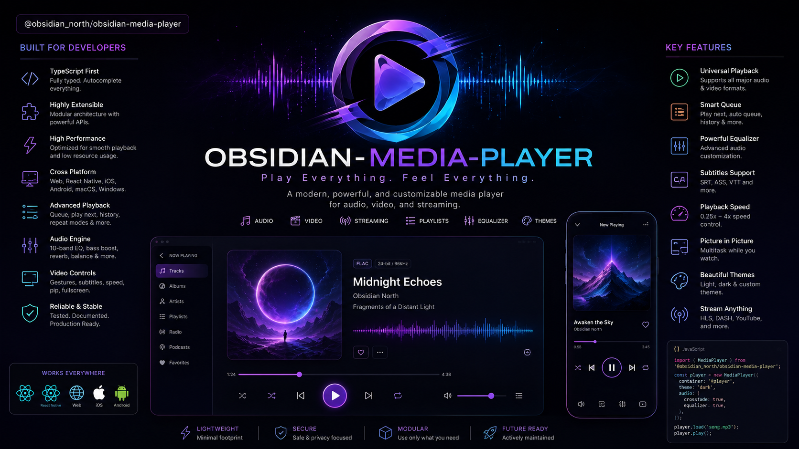

<p align="center">
  
</p>

# obsidian-media-player

Plug-and-play media toolkit for **React + React Native** — one package for **Video**, **Audio** and a full-featured **Music** player. Think `react-native-video` + `expo-av` + `react-native-track-player`, unified under a single idiomatic API. Works on **iOS, Android, and Web** (via `react-native-web`).

- Bare RN, **no Expo dependency** (but ships an **Expo config plugin**). Autolinked via `react-native.config.js` + `ObsidianMediaPlayer.podspec` / `build.gradle`.
- **New Architecture ready** — Codegen specs (`TurboModule` + `codegenNativeComponent` for Fabric) with a **Paper fallback** that works via RN's interop layer when `RCT_NEW_ARCH_ENABLED=0`. The JS compat layer picks the right binding automatically. Built with `react-native-builder-bob` (`lib/commonjs`, `lib/module`, `lib/typescript`).
- Video backed by **AVPlayer + AVPlayerLayer** (iOS) and **ExoPlayer + TextureView** (Android, `androidx.media3`) with an **HTML5 `<video>` fallback on web** (`src/components/Video.web.tsx`).
- Audio / Music backed by **AVPlayer** (iOS, `AVAudioSession` + lock-screen) and **ExoPlayer + MediaSession** (Android, `androidx.media3:media3-session`) with an **HTMLAudioElement fallback on web** (`src/components/Audio.web.tsx`).
- HLS / DASH adaptive streaming (type-aware `MediaSource.type` + `HlsMediaSource`/`DashMediaSource`), per-source **headers + DRM (`drmLicenseUri` → FairPlay/Widevine hook) + `cacheable`** forwarding, a shared **200 MB disk cache**, **offline downloads** (`DownloadManager` / `ObsidianCache`), **background audio**, **lock-screen / headset / CarPlay remote controls**, playlist with **shuffle / repeat**, and a typed **Casting stub** (`CastManager`) ready to wire to Chromecast / AirPlay.

## Install

```bash
npm i obsidian-media-player
# iOS
pod install --project-directory=ios
# Android: no extra step (autolink)
# Web: no extra step — Video/Audio fall back to <video>/<audio> via react-native-web
```

`react-native >= 0.73`, `react >= 18`, iOS 13+, Android `minSdk 21`, Web `react-native-web >= 0.19`.

Build outputs are generated by `react-native-builder-bob` (`npm run prepare` → `lib/commonjs`, `lib/module`, `lib/typescript`); `react-native` field in `package.json` points to `src/index.ts` for Codegen.

### Expo (optional)

```json
// app.json
{ "plugins": [["obsidian-media-player/plugin", { "backgroundAudio": true }]] }
```

The plugin (`plugin/index.js`) adds `UIBackgroundModes: audio` to `Info.plist` and keeps the Android `FOREGROUND_SERVICE`/`mediaPlayback` manifest in sync. Without Expo, add it manually (see Permissions below).

### Permissions

**iOS** `Info.plist`:

```xml
<key>UIBackgroundModes</key><array><string>audio</string></array>
```

**Android** `AndroidManifest.xml` (already declared by the library, but your app must request the runtime permission on Android 13+ if you use notifications for the foreground service):

```xml
<uses-permission android:name="android.permission.POST_NOTIFICATIONS" />
```

When you enable background playback the module configures `AVAudioSession.category = .playback` (iOS) and starts `ObsidianPlaybackService` as a foreground service with a `MediaSession` (Android). Make sure your app enables the audio background mode / foreground-service type `mediaPlayback` if you ship a custom manifest.

## Quick start

```tsx
import { Video, Audio, MusicPlayer, MediaProvider, usePlaybackState } from 'obsidian-media-player';

// Video — renders a native surface
<Video
  source={{ uri: 'https://test-streams.mux.dev/x36xhzz/x36xhzz.m3u8', type: 'hls' }}
  paused={false}
  resizeMode="contain"
  onStateChange={s => console.log(s.status, s.position)}
/>

// Audio — headless
import { useAudioPlayer } from 'obsidian-media-player';
const { state, controls } = useAudioPlayer();
controls.load({ uri: 'https://.../song.mp3' });
controls.play();

// Music player — headless, with a full queue
<MusicPlayer
  tracks={[
    { id: '1', source: { uri: 'https://.../1.mp3' }, title: 'One', artist: 'Obsidian' },
    { id: '2', source: { uri: 'https://.../2.mp3' }, title: 'Two', artist: 'Obsidian' },
  ]}
  repeatMode="queue"
  shuffle={false}
  remoteControls={{ enablePlayPause: true, enableSkip: true, enableSeek: true }}
/>
```

### Imperative handles

```tsx
const ref = useRef<VideoHandle>(null);
<Video ref={ref} source={...} />
ref.current?.seek(30);
ref.current?.pause();

// Audio / Music expose the same shape via their hooks
const { controls } = useMusicPlayer(tracks);
controls.next(); controls.setShuffle(true);
```

### App-wide player with context

```tsx
import { MediaProvider, useMedia } from 'obsidian-media-player';

<MediaProvider initialTracks={tracks} remoteControls={{ enablePlayPause: true }}>
  <App />
</MediaProvider>

// anywhere inside:
const { state, controls, next, toggle } = useMedia();
```

### Derived playback state

```tsx
const d = usePlaybackState(state);
// d.isPlaying, d.isBuffering, d.isEnded, d.progress (0..1)
```

### Remote commands (lock screen / headset)

```tsx
import { useRemoteControls } from 'obsidian-media-player';
useRemoteControls((cmd, payload) => {
  if (cmd === 'next') controls.next();
  if (cmd === 'seek') console.log(payload);
});
```

### Playlist helpers

```ts
import { buildOrder, createQueue, nextCursor } from 'obsidian-media-player';
```

### Casting (stub)

```ts
import { castManager } from 'obsidian-media-player';
await castManager.discover(); // -> [] until a real provider is wired
```

Wire your own Chromecast / AirPlay implementation behind `CastManager` without changing the public API.

### Offline downloads & cache

```ts
import { DownloadManager } from 'obsidian-media-player';

await DownloadManager.download('track-1', { uri: 'https://cdn.test/track.mp3', cacheable: true });
await DownloadManager.download('hls-show', { uri: 'https://cdn.test/show.m3u8', type: 'hls' });
const downloads = await DownloadManager.getDownloads(); // DownloadInfo[]
await DownloadManager.removeDownload('track-1');
await DownloadManager.clearCache();
const bytes = await DownloadManager.getCacheSize(); // Android: SimpleCache size; iOS: URLCache; Web: CacheStorage
```

Native: Android `ExoPlayerProvider` `SimpleCache` (200 MB LRU) + `Hls/DashMediaSource.Factory` with `CacheDataSource`; iOS `ObsidianCacheModule` (`AVAssetDownloadTask` hook for HLS when FairPlay entitlement is present); Web falls back to `CacheStorage`. Also exposed as `CacheNative` (`ObsidianCache` TurboModule) and via `headers`/`drmLicenseUri`/`cacheable` on `MediaSource`.

### Web

`src/components/Video.web.tsx` and `Audio.web.tsx` are auto-picked by Metro for `Platform.OS === 'web'`. Same `<Video source={{uri}} />` JSX works on `react-native-web` / Next.js without touching native code.

### Expo plugin

See Install → Expo. Source: `plugin/index.js` (`withObsidian`). Disable with `{ backgroundAudio: false }`.

### Headers / DRM / cacheable

`MediaSource` fields are now wired end-to-end:

```ts
<Video source={{
  uri: 'https://cdn.test/secure.m3u8',
  type: 'hls',
  headers: { Authorization: 'Bearer ...' },
  drmLicenseUri: 'https://license.test/widevine', // Android Widevine / iOS FairPlay hook
  cacheable: false // bypass disk cache
}} />
```

Android builds a per-source `Hls/Dash/ProgressiveMediaSource` with `DefaultHttpDataSource` headers and `CacheDataSource` toggle; iOS passes `AVURLAssetHTTPHeaderFieldsKey` (and holds `drmLicenseUri` for `AVContentKeySession`).

## API reference

### `MediaSource`

```ts
{ uri: string; type?: 'file'|'hls'|'dash'|'smooth'|'progressive';
  headers?: Record<string,string>; drmLicenseUri?: string; cacheable?: boolean }
```

### `Track`

```ts
{ id: string; source: MediaSource; title?, artist?, album?, artwork?, duration? }
```

### `PlaybackState`

```ts
{ status: 'idle'|'loading'|'ready'|'playing'|'paused'|'buffering'|'ended'|'error';
  position: number; duration: number; rate: number; muted: boolean;
  volume: number; buffered: number; inBackground: boolean; error?: string }
```

### Components

| Component | Props |
|---|---|
| `<Video>` | `source`, `paused`, `muted`, `volume`, `rate`, `resizeMode` (`contain`/`cover`/`stretch`/`none`), `autoPlay`, `repeat`, `onEvent`, `onStateChange`, `onProgress`, `style` |
| `<Audio>` | `source`, `paused`, `volume`, `rate`, `autoPlay`, `loop`, `onEvent` (headless) |
| `<MusicPlayer>` | `tracks`, `autoPlay`, `repeatMode` (`off`/`track`/`queue`), `shuffle`, `remoteControls`, `onEvent` (headless) |

### Hooks

- `useVideoPlayer()` — returns `{ ref, controls, state }` for `<Video>`.
- `useAudioPlayer(initial?)` — `{ state, controls }` (`load/play/pause/stop/seek/setRate/setVolume/setMuted/setLoop/getState`).
- `useMusicPlayer(initialTracks?)` — `{ state, queue, controls }` (`setQueue/addTracks/removeTrack/skipTo/next/previous/play/pause/stop/seek/setRate/setVolume/setMuted/setRepeatMode/setShuffle/setRemoteControls/setBackgroundEnabled/getQueue/getState`).
- `usePlaybackState(state)` — derived `{ isPlaying, isPaused, isBuffering, isLoading, isEnded, hasError, progress }`.
- `useRemoteControls(cb)` — subscribes to lock-screen commands.

### Cache / downloads

- `DownloadManager.download(id, source)` / `removeDownload(id)` / `getDownloads()` / `clearCache()` / `getCacheSize()` — JS façade over `ObsidianCache` (TurboModule `NativeObsidianCache`, native `CacheNative`).
- `CacheNative` — direct TurboModule access (`ObsidianCache`) if you need raw promises.

### Web exports

- `Video` / `Audio` on web resolve to `src/components/Video.web.tsx` / `Audio.web.tsx` (HTML5). No native linking required.

### Functions — complete export map (`src/index.ts`)

All public exports; native calls go via `src/native/*` compat layer (`TurboModuleRegistry.getEnforcing` with `NativeModules` fallback).

#### Components & handles

| Export | Source | What it does |
|---|---|---|
| `Video` + `VideoHandle` | `src/components/Video.tsx` → `src/native/VideoNative.ts` (`ObsidianVideo` Fabric view, `src/specs/NativeObsidianVideo.ts`) | Renders native surface. Handle: `play/pause/stop/seek/setRate/setVolume/setMuted/setResizeMode/getState`. Events: `onStateChange/onProgress/onBuffering/onEnded/onError` |
| `Audio` + `AudioHandle` | `src/components/Audio.tsx` → `NativeObsidianAudio` | Headless. Same handle without `setResizeMode` |
| `MusicPlayer` + `MusicPlayerHandle` | `src/components/MusicPlayer.tsx` → `NativeObsidianMusicPlayer` | Headless queue player. Handle mirrors `useMusicPlayer` controls |

#### Hooks

| Export | Signature | Notes |
|---|---|---|
| `useVideoPlayer()` | `() => { ref, controls: VideoHandle, state: PlaybackState }` | Wraps `<Video>` ref + state |
| `useAudioPlayer(initialSource?)` | `() => { state, controls: AudioControls }` | `controls: load(source)/play/pause/stop/seek/setRate/setVolume/setMuted/setLoop/getState` (`src/hooks/useAudioPlayer.ts`) |
| `useMusicPlayer(initialTracks?)` | `() => { state, queue: QueueSnapshot, controls: MusicControls }` | `controls: setQueue/addTracks/removeTrack/skipTo/next/previous/play/pause/stop/seek/setRate/setVolume/setMuted/setRepeatMode/setShuffle/setRemoteControls/setBackgroundEnabled/getQueue/getState` (`src/hooks/useMusicPlayer.ts`) |
| `usePlaybackState(state)` | `(PlaybackState) => PlaybackDerived` | Derived: `isPlaying/isPaused/isBuffering/isLoading/isEnded/hasError/progress(0..1)` (`src/hooks/usePlaybackState.ts`) |
| `useRemoteControls(cb)` | `( (cmd: RemoteCommand, payload?) => void ) => void` | Subscribes to `remote-play/pause/next/previous/seek/duck` (`src/hooks/useRemoteControls.ts`) |
| `useMedia()` + `MediaProvider` | `src/context/MediaProvider.tsx` | App-wide provider: `{ state, queue, controls, next/previous/toggle, set* }` — wraps `useMusicPlayer` via context |

#### Core / utilities

| Export | Source | Functions |
|---|---|---|
| `PlaylistManager` | `src/core/PlaylistManager.ts` | `buildOrder(count, shuffle)` / `createQueue(tracks)` / `currentIndex(queue)` / `currentTrack(queue)` / `nextCursor(queue)` / `previousCursor(queue)` / `reshuffle(queue)` / `setRepeat(queue, mode)` — pure helpers tested in `__tests__/PlaylistManager.test.ts` |
| `CastManager` / `castManager` | `src/core/CastManager.ts` | `discover(): Promise<CastDevice[]>` / `connect(device)` / `disconnect()` / `onDeviceChange(cb)` / `currentDevice` — **stub** (see Roadmap) |
| `DownloadManager` | `src/core/DownloadManager.ts` | `download(id, source)` / `removeDownload(id)` / `getDownloads(): Promise<DownloadInfo[]>` / `clearCache()` / `getCacheSize(): Promise<number>` — delegates to `CacheNative` or `CacheStorage('obsidian-media')` on web |
| `Events` | `src/core/Events.ts` | Internal event bus for `MediaEvent` (`state/progress/buffering/ended/error/remote-*`) |
| `media` utils | `src/utils/media.ts` | `sourceToJson(source)`, `parseState(json)`, `INITIAL_STATE` |
| `platform` utils | `src/utils/platform.ts` | `isIOS/isAndroid/isWeb` helpers |

#### Low-level native access

| Export | Spec | Methods |
|---|---|---|
| `AudioNative` | `src/specs/NativeObsidianAudio.ts` (`ObsidianAudio`) | `load/ play/ pause/ stop/ seek/ setRate/ setVolume/ setMuted/ setLoop/ getCurrentState(): Promise<string(JSON PlaybackState)>` |
| `MusicPlayerNative` | `src/specs/NativeObsidianMusicPlayer.ts` (`ObsidianMusicPlayer`) | `setQueue/addTracks/removeTrack/skipTo/next/previous/play/pause/stop/seek/setRate/setVolume/setMuted/setRepeatMode/setShuffle/setRemoteControls/setBackgroundEnabled/getCurrentQueue/getCurrentState` |
| `CacheNative` | `src/specs/NativeObsidianCache.ts` (`ObsidianCache`) | `download/removeDownload/getDownloads/clearCache/getCacheSize` (all `Promise<string(JSON)>`) |
| `ObsidianVideoNative` + `Commands` | `src/specs/NativeObsidianVideo.ts` (`ObsidianVideo`) | View props `sourceJson/paused/muted/volume/rate/resizeMode/repeat` + commands `play/pause/stop/seek/setRate/setVolume/setMuted/setResizeMode` |

#### Types (`src/types.ts`)

`MediaSource` / `MediaSourceType` / `Track` / `PlaybackState` / `PlaybackStatus` / `RepeatMode` / `ResizeMode` / `MediaEvent` / `MediaEventType` / `MediaEventHandler` / `RemoteControlOptions` / `CastDevice` / `VideoProps` / `AudioProps` / `MusicPlayerProps`

## Architecture

```
src/
  types.ts            # cross-platform contract
  specs/              # Codegen: NativeObsidian{Video,Audio,MusicPlayer,Cache}
  native/             # compat accessors (New Arch ? TurboModule : NativeModules)
  components/         # Video(.web) / Audio(.web) / MusicPlayer
  hooks/              # use*Player, usePlaybackState, useRemoteControls
  core/               # PlaylistManager, CastManager, DownloadManager, Events
  context/            # MediaProvider
  utils/              # platform + media helpers
ios/
  ObsidianMediaPlayer.podspec, Bridging-Header
  Video/              # ObsidianVideoPlayer + View + Manager (+ Fabric view)
  Audio/              # ObsidianAudioEngine + ObsidianAudioModule
  Music/              # ObsidianRemoteControls + ObsidianMusicPlayerModule
  Cache/              # ObsidianCacheModule (AVAssetDownloadTask hook + URLCache)
android/
  build.gradle / AndroidManifest.xml
  core/               # ExoPlayerProvider (shared cache + buildMediaSource with headers/type/DRM)
  video/              # ObsidianVideoView + Manager
  audio/              # ObsidianAudioModule
  music/              # ObsidianMusicPlayerModule + ObsidianPlaybackService
  cache/              # ObsidianCacheModule (SimpleCache)
  ObsidianMediaPlayerPackage.kt
plugin/               # Expo config plugin (withObsidian) — UIBackgroundModes + foreground service
example/              # bare RN demo (Video / Audio / Music)
__tests__/            # PlaylistManager.test.ts
```

## Roadmap — DON'Ts as Future Implements

> **Offline batch — done.** Items 4–6 were fixed first for offline players (AVPlayer `ios/Cache/ObsidianCacheModule.swift` + Media3 ExoPlayer `android/core/ExoPlayerProvider.kt` + `android/cache/ObsidianCacheModule.kt`). Remaining DON'Ts below are still open.

These are intentional gaps / `pkg` DON'Ts from the audit; tracked here so consumers know what **not** to rely on yet. PRs welcome — each item lists the file to touch.

| # | Gap (DON'T rely on yet) | Current behavior | Future implement | Files |
|---|---|---|---|---|
| 1 | **Casting (Chromecast / AirPlay)** | `src/core/CastManager.ts:16` `discover()` returns `[]`; `connect()` only sets `active` — no SDK | Wire Google Cast SDK (Android) + `AVRoutePickerView`/`GCKDiscoveryManager` (iOS) behind stable `CastManager` API (`discover/connect/disconnect/onDeviceChange`). Keep `CastDevice` `src/types.ts:112` | `src/core/CastManager.ts`, `android/*`, `ios/*`, `src/types.ts:112` |
| 2 | **DRM — Widevine / FairPlay** | `MediaSource.drmLicenseUri` `src/types.ts:19` is passthrough; `android/core/ExoPlayerProvider.kt:79` `// DRM would be wired here` — commented out | Android: `DefaultDrmSessionManager` + `HttpMediaDrmCallback(drmLicenseUri)` in `buildMediaSource()`; iOS: `AVContentKeySession` delegate in `ObsidianVideoPlayer`/`ObsidianCacheModule` | `android/core/ExoPlayerProvider.kt:79`, `ios/Video/ObsidianVideoPlayer.swift`, `ios/Cache/ObsidianCacheModule.swift:35`, `src/types.ts:19` |
| 3 | **SmoothStreaming (`type: 'smooth'`)** | `src/types.ts:9` lists `smooth` but `ExoPlayerProvider.kt:82` `when(type)` only handles `hls/dash/else→Progressive` | Add `SsMediaSource.Factory` (`media3-exoplayer-smoothstreaming`) or remove `smooth` from `MediaSourceType` | `android/core/ExoPlayerProvider.kt:82`, `android/build.gradle:25`, `src/types.ts:9` |
| 4 | **iOS offline HLS downloads** ✅ *fixed* | Now file-based cache `ApplicationSupport/obsidian-media-cache/<id>.<ext>` + `UserDefaults` index, `URLSession.downloadTask` for progressive, `AVAssetDownloadURLSession` for HLS when entitlement present, `getDownloads`/`getCacheSize`/`clearCache`/`removeDownload` implemented | Entitlement-free fallback done; remaining: persist `AVAssetDownloadTask` across reboots | `ios/Cache/ObsidianCacheModule.swift:8,38,47,58`, `src/core/DownloadManager.ts:24` |
| 5 | **Android per-track headers/type/drm** ✅ *fixed* | `Track` now carries `type/drmLicenseUri/cacheable` `ObsidianMusicPlayerModule.kt:27,94` → `buildMediaSource(t.type, t.cacheable, t.drmLicenseUri)` `ObsidianMusicPlayerModule.kt:114` | Full Widevine `DefaultDrmSessionManager` still roadmap #2 | `android/music/ObsidianMusicPlayerModule.kt:27,94,114`, `android/core/ExoPlayerProvider.kt:54` |
| 6 | **Cache write path** ✅ *fixed* | Removed `setCacheWriteDataSinkFactory(null)` `ExoPlayerProvider.kt:43`; `CacheDataSource` now writes via default sink; added `prefetchToCache()` `ExoPlayerProvider.kt:37` for offline pre-warm + `ObsidianCacheModule` background prefetch + `SharedPreferences` index | Verify write throughput on low storage | `android/core/ExoPlayerProvider.kt:37,43` |
| 7 | **Web background / MediaSession / headers** | `<video>/<audio>` fallback `src/components/Video.web.tsx`/`Audio.web.tsx` — `headers` can't be set on `src`, no `MediaSession`/`background` | Web: `fetch`→`blob:` URL for header auth; `navigator.mediaSession` for lock-screen; document `CacheStorage('obsidian-media')` CORS limits | `src/components/Video.web.tsx`, `src/components/Audio.web.tsx`, `src/core/DownloadManager.ts:29` |
| 8 | **Package publishing** | `.npmignore:2` lists `lib/` contradicting `files:lib` `package.json:10`; `1.7MB player.png` dominates tarball; no `exports`/`sideEffects:false`; `codegenConfig.type:"components"` misses TurboModules; loose `peerDeps react:*` | Clean `.npmignore`, exclude `player.png` or host via CDN, add `exports: {".": {types, import, require}}` + `sideEffects:false`, change `codegenConfig` to `type:"all"` or split, pin `react>=18, react-native>=0.73` | `.npmignore:2`, `package.json:9,48,66`, `player.png`, `ios/ObsidianMediaPlayer.podspec:23` |
| 9 | **Video `getState()` staleness** | `src/components/Video.tsx:64` `getState:()=>state` captures closure — can lag native | Sync via `getCurrentState()` native call or `useRef` for latest state | `src/components/Video.tsx:42,64` |
| 10 | **Expo plugin peer** | `plugin/index.js:1` requires `@expo/config-plugins` at runtime without `peerDeps` | Move to `peerDependenciesMeta.optional` or lazy-require with helpful error | `plugin/index.js:1`, `plugin/package.json`, `package.json:47` |

New Architecture is enabled in the app with `RCT_NEW_ARCH_ENABLED=1` (iOS `pod install` reads it; Android reads `newArchEnabled` from `gradle.properties`). When disabled the same native classes are used via the bridge. `lib/` is generated by `react-native-builder-bob` (`commonjs`/`module`/`typescript`).

## Scripts

```bash
npm run typecheck   # tsc --noEmit
npm run lint        # eslint src --max-warnings=0
npm run prepare     # bob build  (also prepack)
npm test            # jest — PlaylistManager
npm run codegen     # react-native codegen — regenerates ObsidianMediaPlayerSpec
```

## Example app

```bash
cd example
npm install
# iOS
pod install --project-directory=ios
npm run ios
# Android
npm run android
# Web (if wired with react-native-web)
npm run web
```

## License

MIT — see `LICENSE`.
